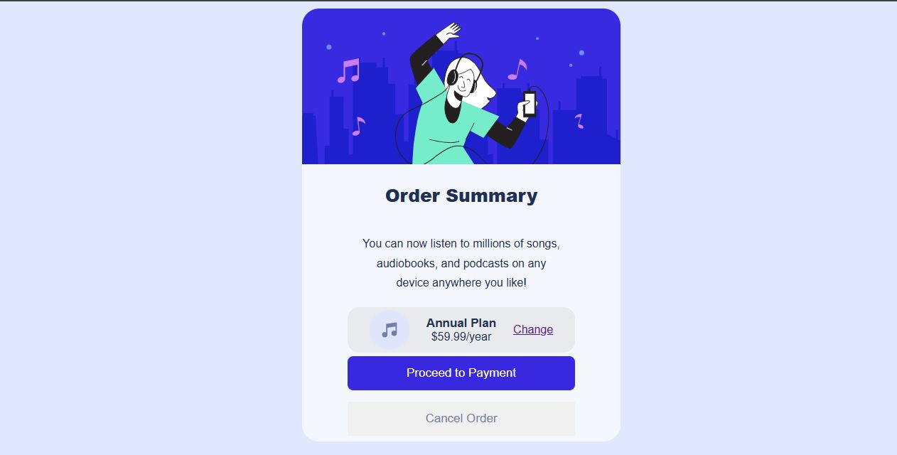

# Frontend Mentor - Order summary card solution

This is a solution to the [Order summary card challenge on Frontend Mentor](https://www.frontendmentor.io/challenges/order-summary-component-QlPmajDUj). Frontend Mentor challenges help you improve your coding skills by building realistic projects.

## Welcome! 👋

Thanks for checking out this front-end coding challenge.

### The challenge

Users should be able to:

- See hover states for interactive elements
Design this [Order summary card solution](./preview.jpg) and get it looking as close to the design as possible using HTML and CSS.

- View the optimal layout for the component depending on their device's screen size

## Screenshot

### Links

- Solution URL: [Order summary card solution](https://github.com/Bennyufy/Order-summary-card-solution-challenge.git)
- Live Site URL: [Order summary card solution](https://bennyufy.github.io/Order-summary-card-solution-challenge/)

### My Process

This was a very easy fast and easy project.I completed it in two hours and i feel proud of that.

### Built with

- Semantic HTML5 markup
- CSS custom properties
- Flexbox
- CSS Grid
- Mobile-first workflow

## Author

- Frontend Mentor - [@Bennyufy](https://www.frontendmentor.io/profile/Bennyufy)
- Github - [@Bennyufy](https://github.com/Bennyufy)
